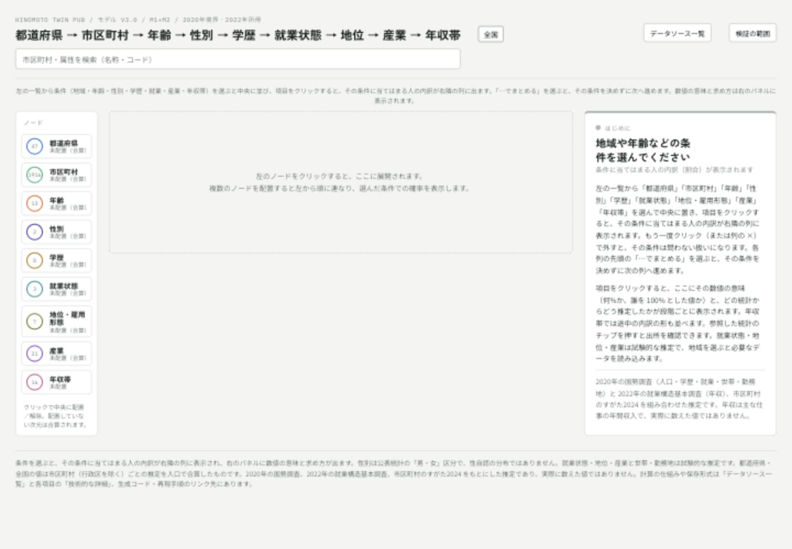
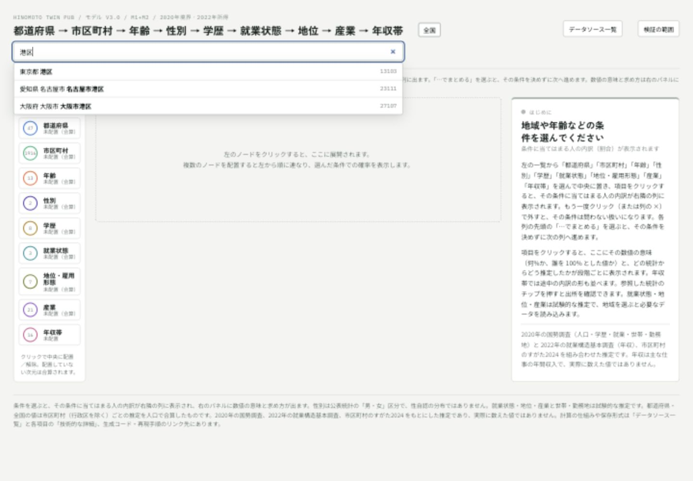
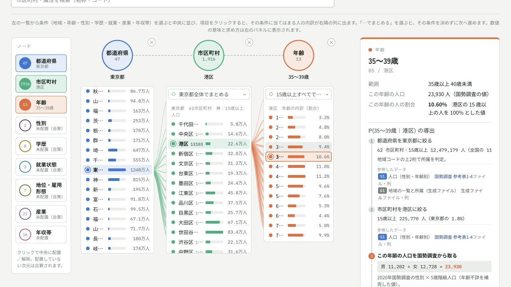
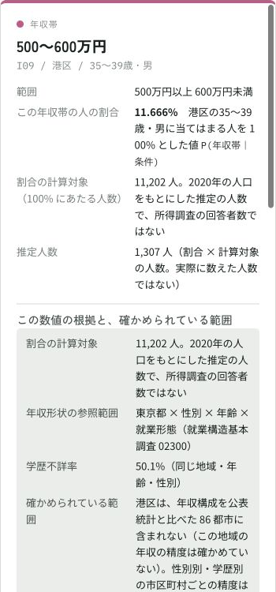
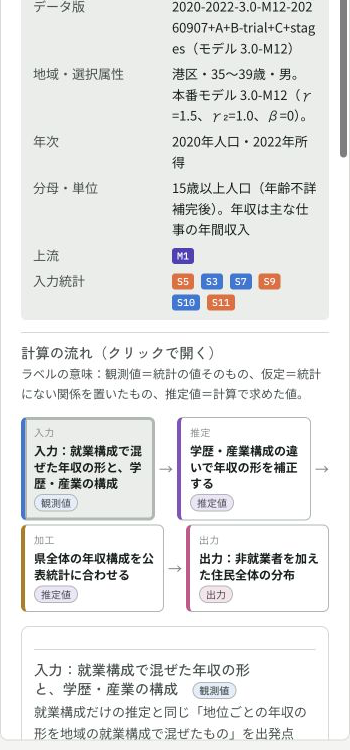
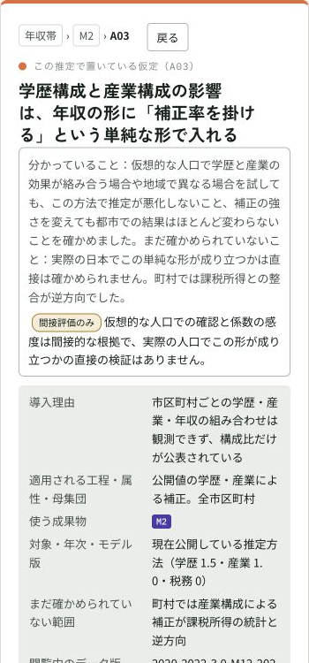
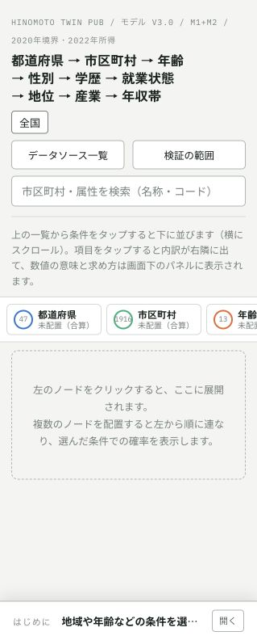

# Hinomoto Twin Pub

公開統計に基づいて、市区町村別の合成人口分布を生成するプロジェクトです。

**「市区町村 × 年齢 × 性別 × 最終学歴 × 個人就業年収」の分布を収録しています。** 最終学歴は国勢調査の学校区分に基づき、在学中・未就学・不詳を別区分にしています。

使い方ガイド更新：2026年9月8日。人口・地域境界・学歴は2020年、所得は2022年の統計を基準にしています。現行の年収推定では税務情報による補正は使っていません。2026年の現況推計ではありません。

**公開ページ（GitHub Pages）：https://mattyamonaca.github.io/hinomoto-twin-pub/**

都道府県 → 市区町村 → 年齢 → 性別 → 学歴 → 年収帯のノードを展開し、各項目の値がどの統計からどう導出されたかをステップ形式で確認できます。推定方法の詳細は [logic.html](https://mattyamonaca.github.io/hinomoto-twin-pub/logic.html) にまとめています。

## 可視化サイトの使い方

**[Hinomoto Twin Explorer を開く](https://mattyamonaca.github.io/hinomoto-twin-pub/)**

地域・年齢・性別などを選び、「その条件に当てはまる人のうち、ある年収帯の人は何%か」を調べられます。結果から、使用した統計、推定の作り方、まだ確かめられていない範囲へ進めます。

> 画面・数値は **2026年9月8日撮影時点**の例です。人口・地域境界は2020年、年収の統計は2022年が基準で、現在の住民を数えた結果ではありません。ここでの年収は**個人の主な仕事からの年間収入**です。世帯年収ではなく、副業・年金・資産収入を含みません。給与は賞与込み・税引前、自営は必要経費控除後です。

### 1. 画面の見方



| 場所 | できること |
|---|---|
| 左の条件一覧 | 「年齢」「学歴」「年収帯」など、調べたい項目を中央に追加する。画面上の「ノード」はこの項目を指す |
| 中央の列 | 地域名や年齢などを選ぶ。選んだ条件に応じた内訳が右隣に表示される |
| 右の説明パネル | 割合の計算対象、推定人数、その数値の求め方を読む |
| 上部の検索欄 | 市区町村を名前や地域コードで探す |
| 「データソース一覧」「検証の範囲」 | 出典や、結果をどこまで確かめているかを確認する |

すべての項目を選ぶ必要はありません。**配置していない条件は絞り込まれません**。例えば学歴を配置しなければ、在学中・不詳なども含む全学歴が対象です。

列が画面に収まらないときは、中央の領域を横にスクロールします。長い説明はページを下へスクロールして読みます。

### 2. 市区町村を検索する

例として、**東京都港区の35〜39歳男性の年収**を調べます。

1. 上部の検索欄に「港区」と入力します。
2. 候補のうち **「東京都 港区 13103」** を選びます。
3. 港区が選択され、地域や年齢の列が表示されます。



同名の地域があるため、都道府県・市名も確認してください。地域コードでも検索できます。検索を使わず、左の「都道府県」「市区町村」を追加し、一覧から順に選ぶこともできます。

### 3. 年齢・性別を絞る

1. 年齢の列で **「35～39歳」** を選びます。列がなければ左の「年齢」を押します。
2. 左の「性別」、または説明パネルの **「この年齢の男女比を展開」** を押します。
3. 性別の列で **「男」** を選びます。
4. 左の **「年収帯」** を押して、年収の内訳を表示します。学歴・就業状態・地位・産業は今回は指定しません。



年齢の列の割合は、**その地域の15歳以上人口を100%**として計算されています。性別の列では、選んだ年齢の男女合計が100%になります。列が進むと割合の計算対象も変わるため、説明パネルと一緒に読みます。

### 4. 年収の割合と人数を読む

年収帯の列で **「500～600万円」** を選びます。これは500万円以上・600万円未満です。



[条件選択を含む画面全体を見る](docs/images/guide/04-income.jpg)

撮影時の説明パネルには、次の値が表示されています。

| 表示 | この例での意味 |
|---|---|
| この年収帯の人の割合：**11.666%** | 港区の35〜39歳男性のうち、年収500〜600万円の人の推定割合 |
| 割合の計算対象：**11,202人** | 港区の35〜39歳男性。年収帯を選ぶ前の人数で、所得調査の回答者数ではない |
| 推定人数：**1,307人** | 計算対象の人数に年収帯の割合を掛けた値。実際に1,307人を確認したという意味ではない |

**11.666%は、港区の住民全体に占める割合ではありません。** 説明を下へ読み進めると「ここまでの条件付き確率を掛け合わせる」があり、港区の15歳以上全体に対して「35〜39歳・男性・年収500〜600万円」の組み合わせが占める割合は、この例では **0.579%** です。どちらも同じ約1,307人を、異なる計算対象に対する割合で表しています。

画面の割合と人数は丸められています。表示された数値だけで掛け算をすると、端数が一致しない場合があります。

### 5. 条件を増やす・広げる・地域を比較する

- **学歴別に見る**：左の「学歴」を追加し、「大学等」などを選びます。年収の計算対象は、その学歴も満たす人に変わります。「在学中」は卒業済みの最終学歴を推定した区分ではありません。「不詳」は他の学歴へ振り分けていません。
- **就業や産業で絞る**：「就業状態」「地位・雇用形態」「産業」を追加し、例えば「就業者」→「正規」→「情報通信業」と選びます。これらは試験的な推定です。取得中は「読み込み中」が終わるのを待ちます。
- **条件を広げる**：列先頭の「男女計でまとめる」「東京都全体でまとめる」などを選びます。その項目を絞らずに内訳を見られます。列の「×」や左の同じ項目を押して外す方法もあります。
- **地域を比較する**：別の市区町村を検索して選び直し、年齢・性別・学歴などを同じ条件にそろえて比較します。地域変更後は上部と説明パネルで条件を確認してください。現行画面は地域を切り替えて見る方式です。

条件を増やすほど人数が少なくなり、細かい組み合わせの結果が実測で確かめられているとは限りません。「学歴不詳」の割合や、次の検証説明も確認してください。

### 6. 「どう推定したか」を見る

1. 年収帯の説明を下へ読み進め、**「参照したデータ」** の **M2** を押します。同じM2が複数ある場合は、どれからでもその推定の説明に進めます。
2. **「学歴・産業構成も使った年収の推定（公開している値）」** が開きます。
3. **「計算の流れ」** の各工程を押し、入力統計・補正・結果を確認します。



[条件選択を含む画面全体を見る](docs/images/guide/05-method.jpg)

出典ラベルの大まかな役割は次のとおりです。番号を覚える必要はありません。横に書かれた日本語の名称で判断できます。

| ラベル | 読み方 |
|---|---|
| **S** | 元になった統計。人口・学歴・年収などの出所を確認する |
| **G** | 地域一覧や地域の対応関係など、作成した整理用データ |
| **M** | 推定・計算で作った結果。押すと作り方の説明を開く |

式を知りたいときだけ「技術的な詳細」を開きます。中間値が「サイト未配信」の場合は、**「生成コード・再現手順」**から計算方法を確認できます。これは未計算・未検証という意味ではなく、途中の数値をサイトに配っていないという意味です。

### 7. 仮定と検証の限界を確認する

推定の説明にある **「独自仮定」** を押すと、その仮定について分かっていることと、まだ確かめられていないことが表示されます。画像は「学歴構成と産業構成の影響」を扱う仮定の例です。



[条件選択を含む画面全体を見る](docs/images/guide/06-assumption.jpg)

下へスクロールすると、「推定に使った統計との一致」「推定に使っていない統計との比較」「正解が分かる仮想的な人口での確認」「仮定を変えたときの変化」が並びます。

- **直接検証済み**でも、説明に書かれた地域・属性・方法の範囲に限られます。選んだ条件すべての精度を保証する表示ではありません。
- **間接評価のみ**は、仮定そのものを実測で確かめたわけではないという意味です。
- **以前の推定方法での確認**は、現在の方法にも同じ結果が当てはまると確認したものではありません。
- **評価対象外**と表示された地域では、その検証による裏付けはありません。

上部の **「検証の範囲」** では全体の注意点、**「データソース一覧」** では統計・加工データ・推定結果の出所を確認できます。推定工程や仮定の画面の「戻る」で直前の説明へ戻れます。

### 8. 世帯・勤務地を見る

市区町村を選んだときの説明パネルから、**「世帯構成を見る」「勤務地を見る」** に進めます。年収の説明を見ている場合は、中央の市区町村の項目を押して地域の説明に戻ります。

- **世帯構成**：港区・那覇市・遠軽町の3地域で試験公開しています。一般世帯が対象で、基本の15歳以上人口とは計算対象が異なります。画面にある人数と適用条件を確認してください。構成員の就業収入を足したものを世帯年収とは扱いません。
- **勤務地**：「居住する人の勤務地」と「働きに来る人の居住地」を切り替えて見ます。勤務地は市区町村単位の推定で、昼間人口ではありません。働きに来る人の居住地を調べる側は産業のみで絞り込めます。年齢・性別・学歴の選択がそのまま適用されるわけではありません。

### 9. スマートフォンで使う

スマートフォンでは、条件一覧が上部、説明パネルが画面下に配置されます。条件と中央の列は横にスクロールします。下部の **「開く」** をタップして説明を読み、閉じて条件選択に戻ります。



### よくある疑問

| 疑問 | 答え |
|---|---|
| 「対象0人」は割合0%という意味？ | 違います。割合の計算対象が0人なので計算できない状態です。条件を広げるか別の地域を選びます。2020年の双葉町が例です |
| 「50万円未満」は全員が働いている？ | いいえ。非就業者・無給家族従業者の、モデル上の就業収入なしも含みます。年金生活者の年金額を表す値ではありません |
| 棒の長さは列をまたいで比べられる？ | 計算対象も表示スケールも異なるため、長さだけで比較せず、表示された%・人数と計算対象を確認します |
| 学歴不詳が多い地域はどう読む？ | 分からない人を他の学歴へ補っていません。分かっている人だけの構成を地域全体の学歴構成とみなさないでください |
| 数値をダウンロードして分析したい | 以下の「提供する分布」「条件付き分布とペルソナ抽出」を参照してください。サイトを見るだけならインストールは不要ですが、全分布の生成・抽出にはコードとデータの準備が必要です |

---

## 提供する分布

主出力は **P（年齢, 性別, 学歴, 年収｜市区町村）**。市区町村を選ぶと、13年齢 × 2性別 × 8学歴 × 16年収の確率が合計1になります。

- 1,741市区町村と175政令市行政区、計1,916地域・6,376,448セル。
- 15歳以上の住民を対象とし、外国人住民・非就業者を含みます。
- 性別は公表統計の「男・女」です。性自認を推定する属性ではありません。
- 年収は主な仕事から通常得る年額。給与は税込み、事業は経費控除後。副業・年金・資産収入は含みません。
- 2020年人口が0の双葉町は確率が未定義です。人口のある1,915地域で分布を提供します。
- 性別・学歴を集約すると従来の市区町村別年齢・年収分布を再現します。

主なファイルは以下のとおりです。`data/`・`validation/` は設定したデータルート内の相対パスです。コードリポジトリとは別に保存します。

| パス | 内容 |
|---|---|
| `data/municipality_age_sex_education_income.csv.gz` | 全国の5属性分布。UTF-8・gzip圧縮CSV |
| `data/municipalities_v2/{市区町村コード}.json.gz` | 地域ごとの分布。例えば港区は13103 |
| `data/municipality_model_v2.npz` | Pythonで読み込む推定人数の配列 |
| `data/schema_v2.json` | 行列の軸、区分コード・名称、確率の定義 |
| `data/education_bins.csv`, `data/sex_bins.csv` | 追加属性の区分と注意点 |
| `data/geography.csv`, `data/age_bins.csv`, `data/income_bins.csv` | 地域・年齢・年収の定義 |
| `data/examples_v2.csv` | 5都市での性別・学歴を指定した推定例 |
| `validation/education_verification.json` | 5属性版の検証結果 |
| `validation/education_sensitivity.json` | 学歴×所得の移植仮定・平滑化・不詳の扱いに対する感度分析 |
| `site/index.html` | 公開ページ（[GitHub Pages](https://mattyamonaca.github.io/hinomoto-twin-pub/)）。導出ステップ・参照データ・検証の範囲を表示 |

CSVのコード列は文字列で読み込んでください。政令市は市全体と各区を含むため、全国集計では両方を同時に合計しないでください。`geography_level=municipality` の1,741地域を使うと重複を避けられます。

CSVの `p_age_sex_education_income_given_municipality` が主出力、`p_income_given_municipality_age_sex_education` は年齢・性別・学歴をすべて条件にした年収確率です。`estimated_count` は小数を含む期待人数です。人口0の条件付き分布はCSVで空欄、JSONでnullです。

## 最終学歴の8区分

| コード | 区分 | 注意点 |
|---|---|---|
| E01 | 小学校・中学校 | 所得表に合わせて統合 |
| E02 | 高校・旧中相当 | 所得接続では専門学校2年未満も含める近似 |
| E03 | 短大・高専等 | 一定の専門学校2年以上4年未満等を含む |
| E04 | 大学等 | 一定の専門学校4年以上等を含む。学士号保有の意味ではない |
| E05 | 大学院 | 修士・専門職・博士を統合 |
| E06 | 在学中 | 卒業済みの学校種別は推定しない |
| E07 | 未就学 | 学校に在学したことがない者 |
| E08 | 不詳 | 卒業学校不詳と在学状況不詳 |

専門学校の扱いは両統計の定義を近づけるための対応付けです。卒業時期や入学資格による厳密な対応を再現できない部分は仮定として記録しています。詳しくは [学歴追加の推定方法](METHOD_V2.md) を参照してください。

今回のモデルでは、不詳が約13.98%、在学中が約6.88%です。不詳を所得から推測して既知の学歴に割り振る処理はしていません。

## 条件付き分布とペルソナ抽出

Python 3.11以上で実行します。コードとデータを別々に取得します。既存の計算済みデータがあれば再計算は不要です。初回の配置方法は [データの管理](DATA.md) を参照してください。

```sh
python3 -m venv .venv
source .venv/bin/activate
python -m pip install -r requirements.txt

# データルートを指定（省略時はコードの隣の hinomoto-twin-data）
export HINOMOTO_DATA_ROOT="../hinomoto-twin-data"
# 初回のみ：固定版の入力データを取得して計算
make dataset
make build

# 港区の全4軸の同時分布（市区町村は条件）
python src/persona_v2.py --municipality 13103

# 港区・35～39歳・男性・大学等の年収分布
python src/persona_v2.py --municipality 13103 --age 35 --sex male --education E04 --income-only

# 同じ条件から10人を抽出
python src/persona_v2.py --municipality 13103 --age 35 --sex male --education E04 --sample 10 --seed 7

# 性別と学歴は分布から抽出
python src/persona_v2.py --municipality 13103 --age 35 --sample 10 --seed 7
```

`--age 35` は35～39歳区分を指定します。1歳単位や1円単位の数値は生成しません。性別は `1/male/男` または `2/female/女`、学歴はE01～E08で指定できます。任意の条件だけを指定し、残りは分布から抽出できます。

Pythonからは `src/persona_v2.py` の `PersonaDistributionV2` を読み込みます。`distribution()` は年齢・性別・学歴・年収の4軸を維持し、指定された属性の軸の長さを1にします。`income_distribution()` は残りの属性を集約した16年収確率を返します。出力はすべて、指定した条件の下で合計1になります。

## 推定と検証

性別はv1で使っていた内部の人口・所得配列を出力に残しています。学歴は2020国勢調査11-2の市区町村別年齢・性別・学校区分人口を基準にします。学歴と就業の関連を国勢調査12-1、学歴と年収の関連を2022就業構造基本調査04000から取り出し、地域の人口と従来の所得分布の双方に合うよう調整します。

**学歴と所得を独立に掛け合わせてはいません。** 一方、全国の学歴別所得の関連を地域に移植する仮定があり、実測された市区町村別学歴・所得の同時分布ではありません。内部整合性の検証と、小地域での精度保証は区別してください。

[推定方法・制約・限界（v2）](METHOD_V2.md)／[基礎モデル（v1）](METHOD.md)／[全出典](SOURCES.md)／[工程間の入出力と再現手順](docs/PIPELINE.md)

### 検証の範囲と感度分析

| 項目 | 内容 |
|---|---|
| 検証できた範囲 | 86都市 × 年齢13区分の就業者の所得構成（TV 0.09328、税係数の都道府県単位交差検証） |
| 未検証の範囲 | 町村・行政区、性別別、学歴別の所得構成、非就業者を含む住民全体の分布 |
| 集計表示の意味 | 公開ページの都道府県・全国は市区町村モデルの加重集計。公表値と一致するのは都道府県 × 性別 × 年齢 × 所得既知の有業者の構成比のみで、年齢・性別をまとめた集計は公表表の総数行と一致しない |
| 感度分析 | `python src/sensitivity_education.py` → `validation/education_sensitivity.json`。有業所得の初期形状にある学歴差を半分に弱めると学歴別の500万円以上の割合は平均1.9ポイント、初期形状の学歴差を除く（学歴別就業率は維持）と4.2ポイント、就業率の学歴差も除くと4.5ポイント動く。平滑化・所得不詳・学歴不詳の扱いに対する感度は0.1〜0.4ポイント |
| 学歴不詳 | 独立区分として保持。不詳率は地域・年齢・性別で大きく異なり（全国13.98%、港区35～39歳男性50.14%）、公開ページで選択中の条件の不詳率を表示 |

詳細は [METHOD_V2.md](METHOD_V2.md) の「学歴不詳の扱いと補完モードの仕様」「移植仮定の感度分析」「検証の範囲」を参照してください。

**属性拡張 段階A（Issue #16・#22）**：就業状態（就業・完全失業・非労働力）、従業上の地位・雇用形態（7区分）と産業（大分類20＋該当なし）を、公開中の5属性分布を周辺として固定したまま条件付きで配分する `make build-employment` と `src/persona_v3.py`、Explorer 用の配布 `make export-employment-web`（市区町村はページ内で同じ配分を再計算、都道府県・全国・政令市は集計ブロック）を追加しました（2026-09-07 固定版で本番公開。5属性の公開値は変わりません。世帯パネルは港区・那覇市・遠軽町の3地域で試験公開）。設計・検証・未観測の関連の影響・配布形式の採用基準は [docs/EMPLOYMENT_A.md](docs/EMPLOYMENT_A.md)。

**属性拡張 段階B（Issue #16・#23、試験）**：2020年国勢調査の世帯表から、選択した市区町村の世帯構成（家族類型・世帯人数・続き柄・構成員の性別と年齢）を生成し、推定に使わない表で復元を評価する `make build-household` と、世帯・構成員を整数個票として抽出して15歳以上の構成員に学歴・就業・産業・年収を結びつける `src/household_sample.py`（`make sample-household`、`make export-household-web` で Explorer の世帯パネル）を追加しました。一般世帯のみが対象で、世帯内の所得相関は未観測です。設計・検証は [docs/HOUSEHOLD_B.md](docs/HOUSEHOLD_B.md)。

**属性拡張 段階C（Issue #24、試験）**：2020年国勢調査の従業地・通学地集計から、全市区町村の居住地 × 勤務地 × 産業の就業者数を推定する `make build-workplace`、条件付き API `src/persona_v4.py`（居住する人の勤務地／働きに来る人の居住地）、Explorer の勤務地パネル用の配布 `make export-workplace-web` を追加しました。勤務地は市区町村まで、対象は 15 歳以上就業者（男女計）で、就業者の勤務地を昼間人口とは呼びません。設計・検証・配布は [docs/WORKPLACE_C.md](docs/WORKPLACE_C.md)。

**Explorer の導出表示（Issue #30）**：公開ページの参照チップ M1〜M6 から「この推定結果の作り方」（入力統計 → 加工 → 推定 → 出力の流れ図、現在の条件の値、観測値・仮定・推定値の区別、未収録値の明示、上流 M へのたどりと戻り）を開けます。設計と検証は [docs/EXPLORER_DERIVATIONS.md](docs/EXPLORER_DERIVATIONS.md)。

**モデル改善の比較実験（Issue #12）**：学歴構成で地域の所得分布を再推定する M1 は、86都市の out-of-fold 比較で加重TVを 0.09328 → 0.09000（3.5%）改善し、仮想人口実験では税務指標が弱い条件で一貫して改善しました。産業構成を加える M2 は単独で 2.1% 改善、M1 との併用では M1 に対して 0.14% の上乗せにとどまります。現在の本番は学歴・産業構成を反映する M12 です。比較実験の設計・データ契約・評価設定・結果・採否理由は [docs/EXPERIMENT_M12.md](docs/EXPERIMENT_M12.md) にまとめています（`make experiment`、`make synthetic` で再現）。M2/M12 を含む仮想人口評価、独立統計（令和5年度 市町村税課税状況等の調）による全市区町村の整合確認、同一分母での M0/M1/M2/M12 比較と係数感度は [docs/VALIDATION_M12.md](docs/VALIDATION_M12.md)（`make fetch-tax-status`、`make validate-m12`、`make synthetic-m12`）。

## 元データと再実行

| 場所 | 内容 | コード側のGit管理 |
|---|---|---|
| `src/` | 取得・加工・推定・出力・検証・抽出 | 対象 |
| `catalog/` | 出典・固定版ハッシュ・取得用表定義・入力形式 | 対象 |
| `site/` | 分布を埋め込まない画面コード | 対象 |
| `$HINOMOTO_DATA_ROOT/raw/` | 元Excel・所得表レスポンス | 対象外 |
| `$HINOMOTO_DATA_ROOT/sources/` | 正規化済み入力 | 対象外 |
| `$HINOMOTO_DATA_ROOT/data/` | 全分布・計算用配列・推定例。`data/stages/` に所得モデルの中間成果物（status / mixture / calibrated、来歴付き。[docs/PIPELINE.md](docs/PIPELINE.md)） | 対象外 |
| `$HINOMOTO_DATA_ROOT/validation/` | 検証結果・処理品質 | 対象外 |
| `$HINOMOTO_DATA_ROOT/web/` | 公開ページ用データ | 対象外 |

`make dataset` で固定版の正規化済み入力を別途取得できます。取得後の推定はオフラインで実行できます。`make paths` で実際の参照先を確認してください。入力と出力の置き場所は個別にも変更できます。移行、アーカイブ、設定の詳細は [DATA.md](DATA.md) を参照してください。

```sh
make build          # v1の基礎推定 → v2の性別・学歴追加
make verify         # v1・v2を検証
make sample
```

v1の計算済みデータがある場合、追加分だけは `make build-education`、検証は `make verify-education` で実行できます。makeがない場合は対応するPythonプログラムを順に実行してください。

```sh
python src/build_education.py
python src/export_education.py
python src/verify_education.py
```

元データからやり直す場合は `make install-source` の後、`make fetch` で取得・加工、保存済み原表なら `make prepare` で加工できます。学歴分だけなら `python src/fetch_education.py` と `python src/parse_education.py` です。e-Statの画面構造・原表更新に影響される可能性があるため、再取得時は出典と検証結果も確認してください。

## 互換性と開発

従来のCSV・NPZ・地域別JSONと `src/persona.py` はv1の形式で利用できます。v1の説明書は [README_V1.md](README_V1.md) に残しています。v2の生成結果には `_v2` または `sex_education` を含む名前を付けています。

開発方針：[CONTRIBUTING.md](CONTRIBUTING.md)。ソフトウェアライセンスは所有者による選定前です：[LICENSE_STATUS.md](LICENSE_STATUS.md)。

**勤務地パネル（2026-09-07 試験公開）**：市区町村から「勤務地を見る」で居住者の勤務地／その地域で働く人の居住地を表示します。流入側は産業のみ条件付け可能です。詳細・推定上の限界は [docs/WORKPLACE_C.md](docs/WORKPLACE_C.md)。
