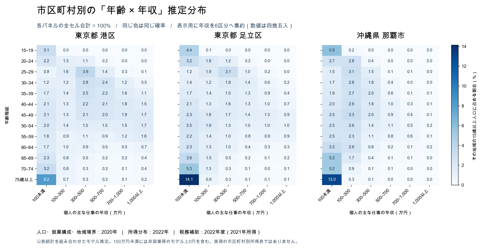

# Hinomoto Twin Pub

市区町村別・年齢 × 個人就業年収の推定分布

作成日：2026年9月5日／モデル v1.1

**主出力は P（年齢区分, 年収区分｜市区町村）です。市区町村を一つ選ぶと、13 × 16 個の確率が合計100%になります。** あわせて P（年収区分｜市区町村, 年齢区分）も収録しました。これは公開統計を組み合わせた合成人口モデルによる推定値であり、市区町村別の所得調査の実測値ではありません。

## リポジトリの使い方

このフォルダには、使用した元統計、加工済み入力、実行済みの推定結果、取得・加工・推定・検証プログラムを保存しています。

| ディレクトリ | 内容 | 通常のGit管理 |
|---|---|---|
| `src/` | 取得、加工、モデル推定、出力、検証、抽出、図の作成 | 対象 |
| `sources/` | 加工済み統計、取得時の表定義、出典・ハッシュ | 対象 |
| `raw/` | 使用した元Excel 5件、所得表レスポンス15件 | 除外。ローカル保存・再取得可能 |
| `raw/exploratory/` | 調査中に取得したが最終推定には使わなかった統計4件 | 除外 |
| `data/` | 全国CSV、地域別JSON、モデル配列 | 除外。再計算可能 |
| `validation/` | 検証結果と処理品質の記録 | 対象 |

新しく取得したコードからも、同梱の `sources/` を使ってオフラインで推定を再実行できます。

```sh
python3 -m venv .venv
source .venv/bin/activate
python -m pip install -r requirements.txt
make build
make verify
make sample
```

Python 3.11以上が必要です。makeがない環境では、後述のPythonコマンドを順番に実行してください。元データの再取得は `make install-source` と `make fetch`、保存済み原表からの再加工は `make prepare` です。`make help` で各操作を確認できます。

開発方針は [CONTRIBUTING.md](CONTRIBUTING.md)、公開前のライセンス選定状態は [LICENSE_STATUS.md](LICENSE_STATUS.md) に記載しています。

## 対象と定義

| 項目 | 内容 |
|---|---|
| 地域 | 2020年境界の1,741市区町村。加えて政令指定都市の175行政区。計1,916地域 |
| 対象者 | 各地域に居住する15歳以上。非就業者・外国人住民を含む |
| 年齢 | 15～19歳から70～74歳まで5歳刻み、75歳以上の13区分 |
| 年収 | 個人の**主な仕事から通常得る年間収入**。給与は賞与を含む税引前、自営業は必要経費控除後・個人の税引前 |
| 含めない収入 | 副業分、年金、資産収入、仕送りなど |
| 基準時点 | 人口・就業構成・地域境界は2020年、所得分布は2022年、税務補助指標は2022年度（原則2021年所得） |
| データ量 | 398,528行＝1,916地域 × 13年齢区分 × 16年収区分 |

**2026年の現況を推計したものではありません。** 時点の違う統計を接続した初期モデルです。2020年の15歳以上人口が0人の双葉町（07546）は、確率を空欄／JSONのnullにしています。人口のある1,915地域では分布が定義されます。

「50万円未満」には非就業者・無給の家族従業者について置いたモデル上の就業収入0円を含めています。統計上の低収入階級から実際の0円と少額収入を分離できないため、**厳密な0円確率は提供していません**。年収は16区分であり、1円単位の金額ではありません。

年収階級は、50万円未満、50～100、100～150、150～200、200～250、250～300、300～400、400～500、500～600、600～700、700～800、800～900、900～1,000、1,000～1,250、1,250～1,500、1,500万円以上です。境界は下限以上・上限未満です。事業赤字も独立には推定していません。

## すぐに使うファイル

| ファイル | 用途 |
|---|---|
| `data/municipality_age_income.csv.gz` | 全地域・全区分の確率。gzip圧縮したUTF-8 CSV |
| `data/municipalities/13103.json` など | 市区町村コードごとの13行 × 16列の確率行列。全1,916地域を収録 |
| `data/geography.csv` | 地域コード・名称・地域階層・人口・定義可否 |
| `data/age_bins.csv`, `data/income_bins.csv` | 行列の区分と境界 |
| `data/municipality_model.npz` | Pythonでの高速読み込み・条件付き抽出用 |
| `examples.csv` | 港区、足立区、横浜市、札幌市、那覇市、御蔵島村の抜粋 |
| `METHOD.md` | 推定式・仮定・検証結果・限界 |
| `SOURCES.md`, `sources/manifest.json` | 元統計のURL、取得・加工情報、ファイルのハッシュ |
| `validation/verification.json` | 実行済み検証の結果 |

同じ場所に圧縮していないCSVも保存しています。gzip版の内容は同じです。CSVの地域コード・年齢コード・所得コードは文字列として読み込んでください。例えば札幌市は `01100` です。

政令指定都市は市全体と各区の両方を収録しています。全国集計には `geography_level=municipality` の1,741地域だけを使うか、市全体を除いて行政区を使ってください。**市全体とその区を同時に足すと二重計上です。** 東京23区は各区を自治体として扱い、「特別区部」の集計地域13100は主出力に含めません。

## 確率の読み方



図は表示用に年収を6区分に集約しています。配布データは16区分です。表示値は四捨五入しています。

港区の例では、15歳以上の住民から一人選んだときに「35～39歳、かつ年収500万円以上」である推定確率は **4.9535%** です。35～39歳の住民に限定して選ぶと、500万円以上である確率は **46.7341%** です。分母が異なります。

| 市区町村 | P（35～39歳かつ500万円以上｜市区町村） | P（500万円以上｜市区町村, 35～39歳） |
|---|---:|---:|
| 東京都港区 | 4.9535% | 46.7341% |
| 東京都足立区 | 2.5995% | 36.3070% |
| 横浜市 | 2.3819% | 33.9380% |
| 札幌市 | 1.3023% | 18.7111% |
| 那覇市 | 0.8025% | 10.8534% |

これらは計算結果の例示であり、自治体が公表した当該組合せの実測値ではありません。

主なCSV列は次のとおりです。

| 列 | 意味 |
|---|---|
| `p_age_income_given_municipality` | **主出力**。その市区町村の15歳以上人口を分母とする年齢 × 年収の同時確率 |
| `p_income_given_municipality_age` | その市区町村の該当年齢人口を分母とする年収確率 |
| `p_age_given_municipality` | その市区町村の年齢構成比。各年収行で同じ値が繰り返される |
| `estimated_count` | 推定人数。小数を含む期待値であり、実在人数ではない |
| `population_municipality_age` | 該当地域・年齢の人口。同一年齢の各年収行で繰り返される |
| `population_15plus` | 地域の15歳以上人口。地域内の全行で繰り返される |
| `p_age_income_given_municipality_without_tax_proxy` | 税務補助情報を使わない比較モデル。信頼区間の上下限ではない |

人口列は繰り返し値なので、そのまま全行合計しないでください。人口が0の年齢行は同時確率が0、年齢条件付き確率が未定義です。地域全体が0人なら同時確率も未定義です。

## 推定ロジックの概要

1. 国勢調査から市区町村別の年齢・性別人口、年齢別就業者数、正規・非正規・役員・自営・家族従業の構成を取得。
2. 欠けている「市区町村 × 年齢 × 就業形態」は、利用できる市区町村または都道府県のクロス表を出発点に、既知の人数と一致するよう反復比例調整（IPF）で補完。
3. 就業構造基本調査の「都道府県 × 年齢 × 性別 × 就業形態 × 年収」を接続。市区町村ごとの就業構成に応じて年収分布を変化させる。
4. 市区町村の課税所得水準を弱い補助情報として加え、都道府県・年齢・性別の公表所得階級構成比に再調整。
5. 非就業者等を加え、性別・就業形態を集約し、市区町村内で正規化。

全国分布との独立な掛け算は行っていません。一方、公開表で分からない地域固有の職業・学歴・企業・産業構成等の影響は残り、細かな地域の真の分布は一意には特定できません。

## 検証の要点

86都市・1,118の都市年齢セルの公表年収分布と比較しました。就業者の既知所得分布について、人口加重した全変動距離は、全国年齢分布の転用で0.1395、都道府県年齢分布の転用で0.09567、今回の補助情報を含むモデルの交差検証で **0.09328** でした。

課税所得の追加による改善は、追加前0.09395に対して相対約0.72%と小さいため、所得を決める強い制約にはしていません。都市データは都道府県集計にも含まれ、独立した個票による検証ではありません。小規模町村・各行政区の精度を保証する結果でもありません。詳細はMETHOD.mdを参照してください。

確率の非負性、地域内合計、年齢条件付き合計、重複行、親市と区の加算関係、都道府県所得構成比との整合、抽出処理を検証し、すべて通過しました。

## 読み込みとペルソナの抽出

Python 3.11以上で、パッケージのディレクトリを作業場所にしてください。

```sh
python -m pip install -r requirements.txt
python src/persona.py --municipality 13103
python src/persona.py --municipality 13103 --age 35
python src/persona.py --municipality 13103 --age 35 --sample 10 --seed 7
```

1つ目は港区の13 × 16行列、2つ目は港区35～39歳の16年収確率、3つ目はそこから10人分の**年齢区分・年収区分**を抽出します。`--age 35` は35歳の単歳推計ではなく、35～39歳区分の指定です。具体的な年齢や金額を区分内で一様に割り当てる処理は、根拠が別途必要なため含めていません。

```python
import pandas as pd

df = pd.read_csv('data/municipality_age_income.csv.gz',
                 dtype={'municipality_code': str, 'age_code': str})
minato = df[df.municipality_code == '13103']
matrix = minato.pivot(index='age_code', columns='income_code',
                      values='p_age_income_given_municipality')
assert abs(matrix.to_numpy().sum() - 1) < 1e-8
```

## 再計算

必要な加工済み公表データは `sources/` に同梱しており、モデルの再計算にはネット接続もAPIキーも不要です。

```sh
python src/build.py
python src/refine_tax.py
python src/export.py
python src/verify.py
```

`build.py` の内部ファイルは非就業等の構造的ゼロを分けた17成分です。**利用する最終分布はexport.pyが出力する16年収区分**です。元配布ZIPで省略していた内部配列もこの作業フォルダには保存しています。Git管理からは除外しているため、新しい取得先ではモデルを再計算してから検証してください。

元ファイルから加工を再現する手順はSOURCES.mdを参照してください。パラメータを変更した場合は、推定仮定と検証結果を同時に更新してください。

## 比較図の再作成

```sh
python -m pip install -r requirements-plot.txt
python src/plot.py --font /path/to/japanese-font.ttf
```

日本語を含むフォントを指定してください。macOSのArial Unicodeがある場合は `--font` を省略できます。図は最終NPZから作成し、表示上のみ所得階級を6群へ集約します。
